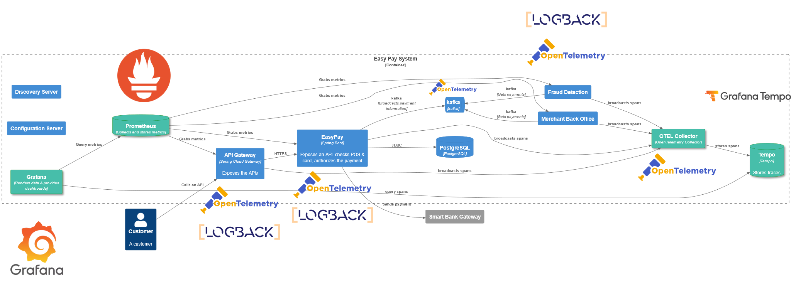

**author: David Pequegnot & Alexandre Touret
summary: Observability
id: observability-workshop
categories: observability
environments: Web
status: Published
feedback link: 

# Make your Java application fully observable with the Grafana Stack

## Introduction

This workshop aims to introduce how to make a Java application fully observable with:
* Proper logs with insightful information
* Metrics with Prometheus
* Distributed Tracing

During this workshop we will use the Grafana stack and Prometheus:

* Grafana: for dashboards
* Loki: for storing our logs
* Tempo: for storing traces
* Prometheus: for gathering and storing metrics.

We will also cover the OpenTelemetry Collector which gathers & broadcast then the data coming from our microservices

## Workshop overview
Duration: 0:02:00

### Application High Level Design


#### API Gateway
Centralises all API calls.

#### Easy Pay Service
Payment microservices which accepts (or not) payments.

This is how it validates every payment:
1. Check the POS number
2. Check the credit card number
3. Check the credit card type
4. Check the payment threshold, it calls the Smart Bank Gateway for authorization

If the payment is validated it stores it and broadcasts it to all the other microservices through Kafka.

#### Fraud detection Service

After fetching a message from the Kafka topic, this service search in its database if the payment's card number is registered for fraud.

In this case, only a WARN log is thrown.

#### Merchant Back Office Service

For this lab, it only simulates the subscription of messages.

#### Smart Bank Gateway
This external service authorizes the payment.

### Our fully observable platform


#### Short explanation

As mentioned earlier, our observability stack is composed of :
* [Prometheus](https://prometheus.io/) for gathering & storing the metrics
* [Loki](https://grafana.com/oss/loki/) for storing the logs
* [Tempo](https://grafana.com/oss/tempo/) for storing the traces
* [Grafana](https://grafana.com/) for the dashboards
* The [OTEL collector](https://opentelemetry.io/docs/collector/) which gathers all the data to send it then to 

In addition, the microservices are started with an agent to broadcast the traces to the collector.   

## Prerequisites
### Skills

| Skill                                                                                                                                                                                                                                                                                   | Level | 
|-----------------------------------------------------------------------------------------------------------------------------------------------------------------------------------------------------------------------------------------------------------------------------------------|---|
| [REST API](https://google.aip.dev/general)                                                                                                                                                                                                                                              | proficient |
| [Java](https://www.oracle.com/java/)                                                                                                                                                                                                                                                    | novice |   
| [Gradle](https://gradle.org/)                                                                                                                                                                                                                                                           | novice |
| [Spring Framework](https://spring.io/projects/spring-framework), [Boot](https://spring.io/projects/spring-boot), [Cloud Config](https://docs.spring.io/spring-cloud-config/docs/current/reference/html/#_quick_start), [Cloud Gateway](https://spring.io/projects/spring-cloud-gateway) | novice |
| [Docker](https://docs.docker.com/)                                                                                                                                                                                                                                                      | novice |
| [Grafana stack](https://grafana.com/)                                                                                                                                                                                                                                                   | novice |
| [Prometheus](https://prometheus.io/)                                                                                                                                                                                                                                                    | novice |
| [kafka](https://kafka.apache.org/)                                                                                                                                                                                                                                                      | novice |

### Tools
#### If you want to execute this workshop locally
You **MUST** have set up these tools first:
* [Java 21+](https://adoptium.net/temurin/releases/?version=21)
* [Gradle 8.7+](https://gradle.org/)
* [Docker](https://docs.docker.com/) & [Docker compose](https://docs.docker.com/compose/)
* Any IDE ([IntelliJ IDEA](https://www.jetbrains.com/idea), [VSCode](https://code.visualstudio.com/), [Netbeans](https://netbeans.apache.org/),...) you want
* [cURL](https://curl.se/), [jq](https://stedolan.github.io/jq/), [HTTPie](https://httpie.io/) or any tool to call your REST APIs

Here are commands to validate your environment:

**Java**

```jshelllanguage
openjdk version "21.0.3" 2024-04-16 LTS
OpenJDK Runtime Environment Temurin-21.0.3+9 (build 21.0.3+9-LTS)
OpenJDK 64-Bit Server VM Temurin-21.0.3+9 (build 21.0.3+9-LTS, mixed mode, sharing)
```

**Gradle**

If you use the wrapper, you won't have troubles. Otherwise...:

```jshelllanguage
$ gradle -version

    ------------------------------------------------------------
Gradle 8.7
        ------------------------------------------------------------

Build time:   2024-03-22 15:52:46 UTC
Revision:     650af14d7653aa949fce5e886e685efc9cf97c10

Kotlin:       1.9.22
Groovy:       3.0.17
Ant:          Apache Ant(TM) version 1.10.13 compiled on January 4 2023
JVM:          21.0.3 (Eclipse Adoptium 21.0.3+9-LTS)
OS:           Linux 5.15.146.1-microsoft-standard-WSL2 amd64
```

**Docker Compose**

``` bash
docker compose version
    
Docker Compose version v2.24.7
```

#### If you don't want to bother with a local setup

##### With Gitpod (recommended)
You can use [Gitpod](https://gitpod.io).
You must create an account first.
You then can open this project in either your local VS Code or directly in your browser:

[](https://gitpod.io/#github.com/alexandre-touret/observability-workshop.git)

## Environment Setup
Duration: 0:05:00

### Open GitPod

We will assume you will use GitPod for this workshop :) 

[](https://gitpod.io/#github.com/alexandre-touret/observability-workshop.git)

### Start the infrastructure

The "infrastructure stack" is composed of the following components:
* One [PostgreSQL](https://www.postgresql.org/) instance per micro service
 *One [Kafka broker](https://kafka.apache.org/)

To run it, execute the following command

``` bash
docker compose up -d
```

To check if all the services are up, you can run this command:


``` bash
docker compose ps
```

Negative
: TODO ajouter retour commande

> aside negative
> 
> TODO ajouter retour commande


### Start the Service discovery & configuration server

Our microservices use a [Service Discovery](https://spring.io/guides/gs/service-registration-and-discovery) microservice to enable load balancing & loose coupling.

A [Configuration server](https://docs.spring.io/spring-cloud-config/) is also used to centralise the configuration of our microservices.

_Normally_ you don't have to bother yourself with these programs. 
You just have to start them once with the following command: 

```bash

```
> aside negative
>
> TODO ajouter retour commande
        
### Start the rest of our microservices
        
You can now start the application with the following commands

#### The REST Easy Pay Service
Run the following command:

```bash
```

#### The Merchant BO
Run the following command:

```bash
```    
#### The Fraud System
Run the following command:

```bash
```    

#### The Smart Bank Gateway
Run the following command:

```bash
```    

#### The API Gateway

Run the following command:

```bash
```
#### Validation

## Logs 
Duration: 0:30:00

## Metrics
Duration: 0:30:00

## Traces
Duration: 0:20:00

## Correlation
Duration: 0:15:00

## Performance testing: ALL IN!!
Duration: 0:15:00
